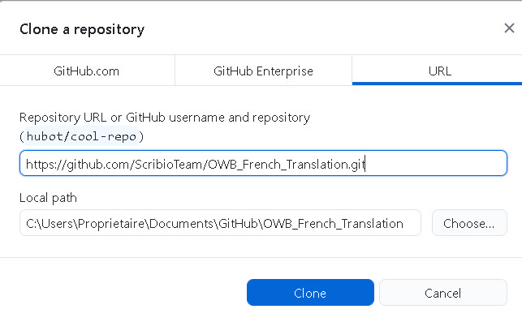
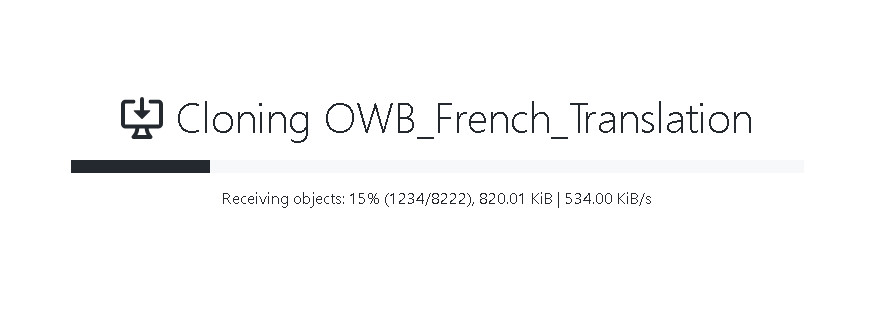
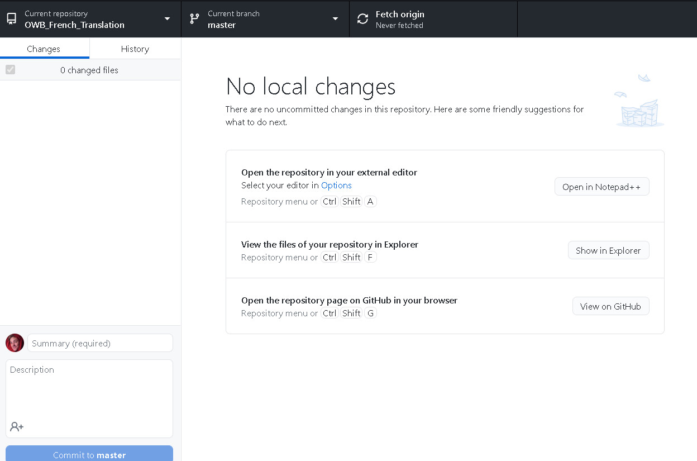
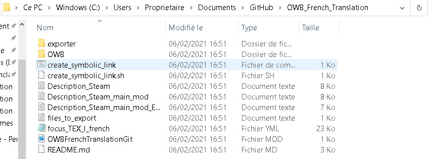
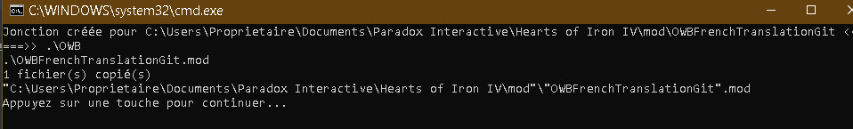
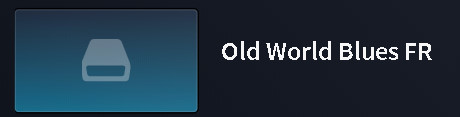
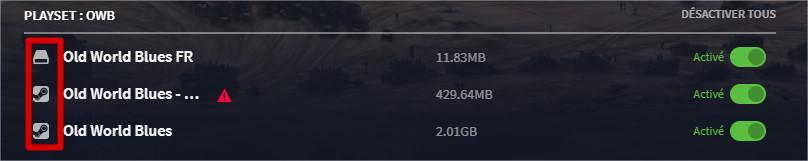
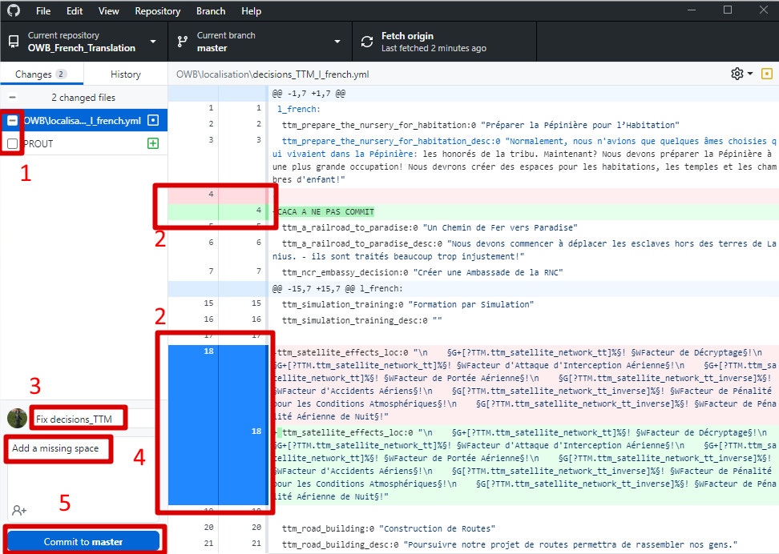

# Setup the mod with GitHub Desktop

This documentation will explain you how to setup the translation mod to test it.

## Prerequisites

You need to be a contributor of the mod.

Otherwise, you can do the installation for your fork of the mod.

## GitHub Desktop

[Download](https://desktop.github.com/) and install GitHub Desktop.

You will have something like the following image.

## Install the mod locally

Click on `ScribioTeam/OWB_French_Translation` at the right.
You will have the following window.

You change the local path before OWB_French_Translation if you want but in general the default is a good choice.

Click on `Clone`. It will "clone" (download a copy) of the translation mod which can take some time as seen in the following image.

At the end of the cloning, you will see something like that

## Testing the mod

Open the cloned directory (the directory which was the local path in the cloning windows, by default Documents/GitHub/OWB_French_Translation).

Double-click on `create_symbolic_link` on Windows or `create_symbolic_link.sh` on Linux.

If you have no error you will have something like this.

If you see an error, open the create_symbolic_link file with a text editor.
Replace the part after `modDir=` by the path of your `Paradox Interactive\Hearts of Iron IV\mod`.
De not forget to put " to manage path with spaces if you want to avoid to put backslashs.

You will see the mod in the HoI4 launcher with an hardrive image or icon (instead of mod image or Steam icon for workshop mod) according your displaying mode.

## Edit the mod

You can now make changes in the cloned mod (the directory which was the local path in the cloning windows, by default Documents/GitHub/OWB_French_Translation).

When your changes work you must commit them. The numbers refers to the following image.

1. Check the files to add;
2. Click on each file and click on lines to do not include (the included lines are in blue). The lines in red are deleted and the lines in green added;
3. Describe in 50 characters the changes;
4. Describe with more details the changes;
5. Click on the commit button.

Finally you need to click on the button with an upper arrow to push it on internet.

Nota: You should also click on this button when there is an bottom arrow to get the contributions from other people.
