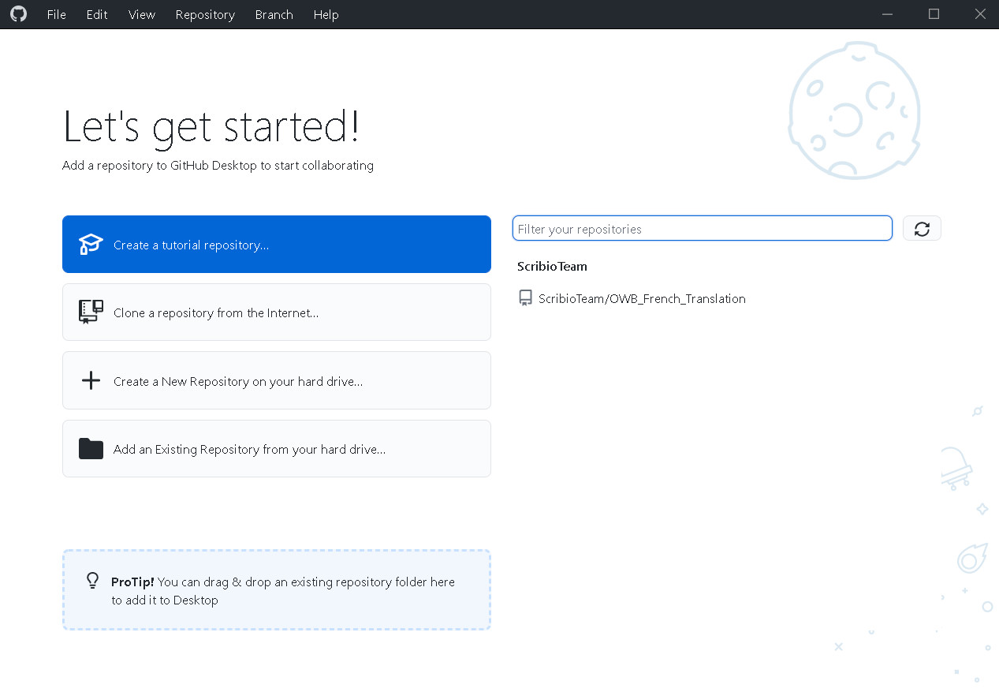

# Setup the mod with GitHub Desktop

This documentation will explain you how to setup the translation mod to test it.

## Prerequisites

You need to be a contributor of the mod.

Otherwise, you can do the installation for your fork of the mod.

## GitHub Desktop

Download and install GitHub Desktop.

You will have something like the following image.

## Install the mod locally

Click on `ScribioTeam/OWB_French_Translation` at the right.
You will have the following window.

You change the local path before OWB_French_Translation if you want but in general the default is a good choice.

Click on `Clone`. It will "clone" (download a copy) of the translation mod which can take some time as seen in the following image.

At the end of the cloning, you will see something like that

## Testing the mod

Double-click on `create_symbolic_link` on Windows or `create_symbolic_link.sh` on Linux.

If you have no error you will have something like this.

## Edit the mod

You can now make changes in the cloned mod (the directory which was the local path in the cloning windows, by default Documents/GitHub/OWB_French_Translation).

> TODO complete this section